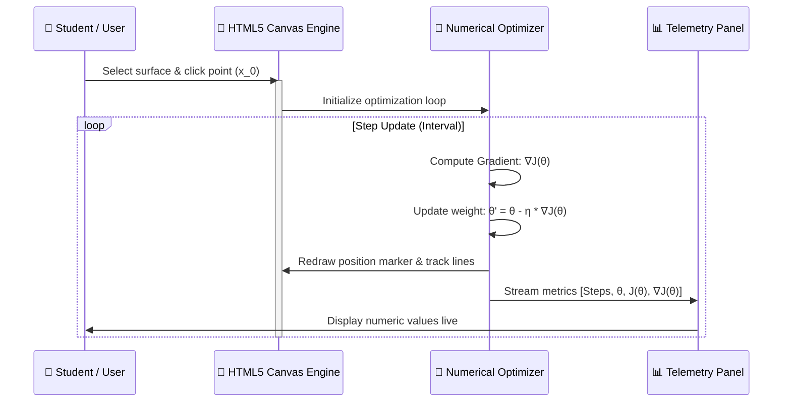

<div align="center">

  

  # 🎓 Premium AI/ML IIT Mandi Curricular Hub & GitHub Simulator

  **An ultra-premium, offline-first educational platform and workspace simulator built using Neo-Brutalist design principles.**

  [](https://astro.build/)
  [](https://www.typescriptlang.org/)
  [](https://html.spec.whatwg.org/)
  [](https://www.w3.org/Style/CSS/)
  [](https://git-scm.com/)

  [✨ Visual Simulators](#-key-interactive-visualizers--features) • [🏛️ Architecture](#-system-architecture) • [🚀 Core Features](#-key-interactive-visualizers--features) • [📂 Codebase Tour](#-codebase-directory-tour) • [⚡ Command Suite](#-operations-manual)

</div>

---

## 🏛️ System Architecture

The ecosystem leverages Astro's high-performance static rendering, structured Markdown content collections, and real-time client-side interactivity to build an ultra-responsive interface.

```mermaid
graph TD
    %% Base Layout Definition
    A[Astro Base Layout] --> B[Syllabus & Guidance Hub]
    A --> C[Searchable Lecture Vault]
    A --> D[GitHub Repository Simulator]
    A --> E[Live Optimization Laboratory]
    A --> F[GitHub Profile & Syncer /github]
    
    %% Lecture Subtree
    C --> C1[Foundations Math]
    C --> C2[Classical Machine Learning]
    C --> C3[Deep Learning & Optimization]
    C --> C4[Generative AI & MLOps]
    
    %% Repository Subtree
    D --> D1[Code Tree Explorer]
    D --> D2[Issues & PR tracker]
    D --> D3[CI/CD Actions Log]
    
    %% Optimization Sandbox Subtree
    E --> E1[Loss Surfaces Selection]
    E --> E2[Interactive Parameter Picker]
    E --> E3[Real-time Convergence Telemetry]
    
    %% Local Syncer Pipeline
    F --> F1[Node.js Filesystem Scanner: 05_Open_Source_Repos]
    F --> F2[Heatmap Contribution Calendar]
    F --> F3[Interactive Shell Console Sync]
    
    %% Design styling tokens
    style A fill:#8B5CF6,stroke:#111,stroke-width:3px,color:#fff
    style C fill:#F59E0B,stroke:#111,stroke-width:2px,color:#000
    style D fill:#10B981,stroke:#111,stroke-width:2px,color:#000
    style E fill:#EC4899,stroke:#111,stroke-width:2px,color:#fff
    style F fill:#3B82F6,stroke:#111,stroke-width:2px,color:#fff
```



---

## 🚀 Key Interactive Visualizers & Features

### 📈 1. Real-Time HTML5 Canvas Gradient Descent Simulator (`/experiments/gradient-descent`)
An immersive, high-performance mathematical convergence sandbox that maps parameter updates visually:
*   **Loss Landscapes**: Toggle dynamically between **Convex Quadratic Well** ($f(x) = x^2$), **Non-Convex Double Well** ($f(x) = x^4 - 2x^2$), and a **Noisy Stochastic** surface.
*   **Interactive Parameters**: Directly click anywhere on the loss curve to place starting parameters ($\theta_0$).
*   **Live Telemetry**: Watch the algorithm step through convergence in real-time, showing weights ($\theta$), error rate ($J(\theta)$), derivative rates ($\nabla J(\theta)$), and step counters on a high-contrast panel.



### 📂 2. GitHub-Style Project Repo Explorer (`/projects/[slug]`)
A fully-featured mock GitHub workspace simulating real repository navigation:
*   **Code Tab**: A split-screen layout with an interactive directory tree. Click Python files to load code with a customized high-contrast Brutalist viewer, complete with the compiled markdown `README.md` at the bottom of the page.
*   **Issues Tab**: A thread tracking repository tasks, complete with custom labels (`VUS`, `bug`, `documentation`), author details, and discussion replies.
*   **Pull Requests Tab**: Shows open branches, author statistics, merging channels, and branch names.
*   **Actions Tab**: A real-time log tracking green-checked static compilation builds and test executions.

### 🔀 3. Local Workspace Git Folder Syncer (`/github`)
An advanced developer hub directly reading from your local disk space:
*   **Local Disk Scanning**: Utilizes Node.js filesystem hooks (`fs.readdirSync`) to scan folders under `05_Open_Source_Repos/` dynamically, rendering folder and file structures instantly.
*   **Integrated Heatmap Calendar**: A beautiful, 12-month contribution graph that tracks and displays simulated commit logs. Hovering over a square displays counts and dates; clicking a square triggers an interactive toast detailing changed files.
*   **Git Shell Terminal**: An interactive terminal executing mock git operations. Type operations or run sync triggers to execute fully-animated shell sequences.

### 🧠 4. Dynamic Curriculum Vault & Module 00 Introductory Engine (`/lectures`)
An advanced searchable daily lecture indexing system complete with instant filtering buttons:
*   **Module 00: Foundations Bedrock**: Provides comprehensive notes covering the conceptual bridge from expert rule-based systems to parametric optimization (AI vs. ML, Feature Extraction, and the Curse of Dimensionality sparsity equation).
*   **The Linear Mathematical Neuron**: Explains mathematical neurons modeled as hyperplane classifiers ($W^T X + b = 0$), discrete classification step thresholding, Data vs. Parametric (weight) dual coordinate spaces, Gradient Descent parameter optimization using partial derivatives, and One-Hot binary class vector representation.
*   **Tactile Multi-Format CTAs**: Day cards provide clean, separated buttons to open PDF lecture notes, view code repositories, or read detailed web notes, strictly preventing nested anchor bugs.

### ⚡ 5. Progressive Web App (PWA) & Offline-First Strategy
Full smartphone installability and network resilience:
*   **Background Caching (`sw.js`)**: Employs a dynamic *Network-First with Cache Fallback* strategy, caching successful GET requests locally in standard service worker storage.
*   **Installability (`manifest.json`)**: Configured with sleek brutalist colors, standalone app displays, clean portrait orientations, and customized neural network launcher icons.
*   **PWA Meta Integrations**: Injected with Apple-specific web app capability tags and status bar colors to enable native-feeling standalone execution.

### 📱 6. Mobile Squeeze-Proof Layouts & Styling Tokens (`global.css`)
Visual excellence powered by sleek Neo-Brutalist aesthetics:
*   **Responsive Grid System**: Grid configurations stack fluidly to 100% width on viewports `< 768px`, ensuring a robust layout on screens down to 320px.
*   **Brutal Active States**: Hovering highlights raise offset elements, tilt images, underline titles, and cast heavy solid drop shadows (`box-shadow: 4px 4px 0px #000`) for premium micro-interactive feedback.
*   **Interactive Brand Logo & Compact Header**: Embedded with small, responsive neural icons (`14px` inside header, `18px` inside footer) displaying real-time system status indicators.

---

## 🏛️ Codebase Directory Tour

The Astro project is structured logically to maintain strict division between static data, reusable components, and high-performance pages:

```text
03_Website/
├── public/                       # Favicons, vector branding, manifests, service worker
│   ├── icons/                    # High-contrast neural network launcher images
│   ├── manifest.json             # PWA app installability configurations
│   └── sw.js                     # Dynamic Network-First service worker cache
├── src/
│   ├── assets/                   # Course illustration assets and vectors
│   ├── components/               # High-contrast Neo-Brutalist components
│   │   ├── FileTree.astro        # Recursive repository folder explorer
│   │   ├── GitHubRepoCard.astro  # Compact repository cards showcase
│   │   ├── NeoCard.astro         # Modular brutalist card wrapper
│   │   └── TabItem.astro         # Repository tab navigation buttons
│   ├── content/                  # Structured markdown collection databases
│   │   ├── lectures/             # Daily curricular notes (Foundations to GenAI)
│   │   └── projects/             # Mock repository frontmatters and contents
│   ├── layouts/
│   │   └── BaseLayout.astro      # Master layout (Header, Nav, Footer, Theme)
│   ├── pages/                    # Multi-route Astro static pages
│   │   ├── domains/              # Interactive domain-deep dive directories
│   │   ├── how-to-use/           # Guidebooks and interactive from-scratch codebases
│   │   ├── experiments/          # Sandbox directories
│   │   │   ├── index.astro       # Visualizers directory
│   │   │   └── gradient-descent.astro # Gradient descent canvas sandbox
│   │   ├── lectures/
│   │   │   └── index.astro       # Searchable & filterable Lecture Vault
│   │   ├── projects/
│   │   │   ├── index.astro       # Repository portfolio grid
│   │   │   └── [slug].astro      # Full GitHub repo viewer with 4 tabs
│   │   ├── github.astro          # Local filesystem scanner & syncer page
│   │   └── index.astro           # Course landing page & central dashboard
│   └── styles/
│       └── global.css            # Central Brutalist styling tokens and grids
├── astro.config.mjs              # Astro engine configurations
├── package.json                  # Engine dependencies and scripts
└── tsconfig.json                 # Strict TypeScript rule engine
```

---

## ⚡ Operations Manual

Ensure you have [Node.js](https://nodejs.org/) installed on your machine. All commands should be executed from the root of the `03_Website/` directory:

| Task Description | Command Line | Action Outcome |
| :--- | :--- | :--- |
| **Install Project Modules** | `npm install` | Restores Astro core packages and UI styling engines. |
| **Boot Local Sandbox** | `npm run dev` | Spins up a hot-reloading development server at `http://localhost:4321`. |
| **Verify Compilation** | `npm run build` | Compiles optimized static production pages under `/dist/`. |
| **Simulate Web Build** | `npm run preview` | Spins up a local web server displaying output files inside `/dist/`. |

---

<div align="center">
  <p>Developed and Created by <b>Ayush Kumar Sahoo</b> with 🖤 for the IIT Mandi AI/ML Curricular Hub Initiative.</p>
</div>
