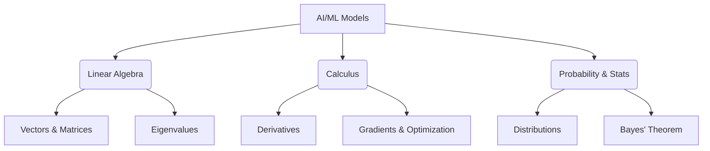

# Mathematical & Programming Foundations

Welcome to the foundation of Artificial Intelligence. Before we can build complex predictive models or generative transformers, we must understand the fundamental mathematics and programming tools that power them.

## Core Pillars of AI

To build AI, we rely on three core mathematical pillars.



### 1. Linear Algebra
Linear algebra is the language of data. When dealing with images, text, or spreadsheets, we represent this data as **Tensors** (multi-dimensional arrays). 

### 2. Calculus
Calculus, specifically partial derivatives, tells our models *how* to learn. By calculating the gradient of a loss function, a neural network knows which direction to adjust its weights.

### 3. Probability & Statistics
AI models don't deal in absolutes; they deal in probabilities. Is this image a cat? The model says: "I am 92% confident it is a cat."

---

## Tooling Comparison

As an AI practitioner, you must master the Python data stack. Here is a breakdown of the core libraries you will use daily:

| Library | Primary Use Case | Analogy |
|---------|------------------|---------|
| **NumPy** | High-performance vector/matrix math | The engine of a car |
| **Pandas** | Tabular data manipulation and cleaning | Excel on steroids |
| **Matplotlib** | Static data visualization | The dashboard |
| **Scikit-Learn**| Classical ML algorithms | The driver |

---

## Practical Example: NumPy in Action

Let's look at a very simple example of how we use NumPy to perform vectorized operations. Vectorization is crucial because it runs heavily optimized C code under the hood, making it magnitudes faster than standard Python `for` loops.

```python
import numpy as np

# 1. Creating Tensors (Vectors)
weights = np.array([0.5, -0.2, 0.1])
inputs = np.array([1.0, 2.0, 3.0])

# 2. The Dot Product (Core to all Neural Networks)
# This multiplies element-wise and sums the result
activation = np.dot(weights, inputs)

print(f"The raw activation is: {activation}")

# 3. Applying a simple activation function (ReLU)
output = np.maximum(0, activation)
print(f"The final output is: {output}")
```

> [!TIP]
> **Best Practice:** Always try to use NumPy's built-in functions (like `np.dot` or `np.sum`) instead of iterating through arrays manually.

## Next Steps
In the next session, we will take these mathematical concepts and apply them to our first actual predictive models in Phase 2!
