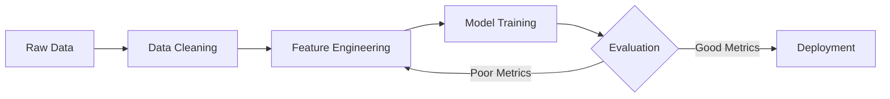

# Classical Machine Learning

Machine Learning is fundamentally about finding patterns in data and using those patterns to make predictions about unseen data. In this phase, we move beyond hardcoded rules and let algorithms learn from experience.

## Supervised vs Unsupervised Learning

The two primary paradigms of classical machine learning differ by the presence of "labels" in the data.

| Paradigm | Data Type | Goal | Algorithms |
|----------|-----------|------|------------|
| **Supervised** | Labeled (X and y) | Predict a specific target variable | Linear Regression, Random Forest, SVM |
| **Unsupervised** | Unlabeled (only X)| Discover hidden structures/groups | K-Means Clustering, PCA |

## The Machine Learning Pipeline

Building a model isn't just about calling `fit()`. It involves a rigorous, cyclical pipeline:



### The Bias-Variance Tradeoff
One of the most important concepts in ML is balancing **Bias** (underfitting) and **Variance** (overfitting).
- **High Bias**: The model is too simple and fails to capture the underlying trend (e.g., trying to fit a straight line to a curved dataset).
- **High Variance**: The model is too complex and memorizes the training data noise, failing to generalize to new data.

---

## Practical Example: Scikit-Learn

`scikit-learn` is the gold standard library for classical ML in Python. It provides a clean, unified API for almost every algorithm.

Let's look at training a Random Forest Classifier to predict whether a patient has a disease based on their medical features.

```python
from sklearn.model_selection import train_test_split
from sklearn.ensemble import RandomForestClassifier
from sklearn.metrics import accuracy_score, classification_report
import pandas as pd

# 1. Load Data (assuming we have a dataset)
# df = pd.read_csv('patient_data.csv')
# X = df.drop('disease_present', axis=1)
# y = df['disease_present']

# 2. Split Data (80% for training, 20% for testing)
# We MUST evaluate on data the model has never seen!
X_train, X_test, y_train, y_test = train_test_split(X, y, test_size=0.2, random_state=42)

# 3. Initialize and Train the Model
rf_model = RandomForestClassifier(n_estimators=100, max_depth=5)
rf_model.fit(X_train, y_train)

# 4. Make Predictions and Evaluate
predictions = rf_model.predict(X_test)
accuracy = accuracy_score(y_test, predictions)

print(f"Model Accuracy: {accuracy * 100:.2f}%")
print(classification_report(y_test, predictions))
```

> [!WARNING]
> **Data Leakage:** Never let your test data influence your training process (e.g., fitting a scaler on the entire dataset before splitting). Always fit your preprocessors *only* on the training data!
