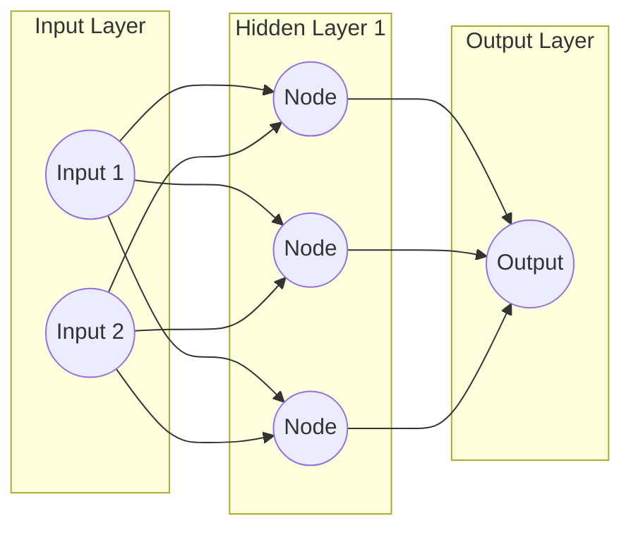

# Deep Learning & Neural Networks

When classical machine learning algorithms hit a performance plateau with complex, unstructured data (like images, audio, and raw text), we turn to Deep Learning. Deep learning relies on Artificial Neural Networks inspired by the human brain.

## The Neural Architecture

At its core, a neural network is composed of interconnected layers of "neurons" (perceptrons).



### 1. Forward Propagation
Data flows from left to right. Each connection has a `weight` and a `bias`. The node computes a weighted sum and passes it through an **Activation Function** (like ReLU or Sigmoid) to introduce non-linearity.

### 2. Loss Function
Once the network makes a prediction, we compare it to the actual truth using a Loss Function (e.g., Mean Squared Error for regression, Cross-Entropy for classification). This gives us an "error score."

### 3. Backpropagation & Optimization
The magic of deep learning! The network calculates the gradient of the loss function with respect to every single weight using the Chain Rule (Calculus). An optimizer (like Adam or SGD) then updates the weights to minimize the error.

---

## Advanced Architectures

You don't always use simple dense networks. Depending on the data type, specialized architectures excel:

| Architecture | Best Used For | Why it Works |
|--------------|---------------|--------------|
| **CNNs (Convolutional)** | Images & Video | Uses filters to capture spatial hierarchies and edges. |
| **RNNs / LSTMs** | Text & Time-Series | Maintains a "memory" of previous inputs for sequence data. |
| **Transformers** | Advanced NLP | Uses "Attention" to process entire sequences simultaneously. |

---

## Practical Example: PyTorch

PyTorch is the dominant framework in AI research and industry for building deep neural networks. It utilizes "Tensors" that can be moved to GPUs for massive parallel processing.

```python
import torch
import torch.nn as nn

# 1. Define a simple Multi-Layer Perceptron (MLP)
class SimpleNetwork(nn.Module):
    def __init__(self):
        super(SimpleNetwork, self).__init__()
        # Input: 10 features, Hidden: 20 nodes, Output: 2 classes
        self.layer1 = nn.Linear(10, 20)
        self.relu = nn.ReLU()
        self.layer2 = nn.Linear(20, 2)
        
    def forward(self, x):
        x = self.layer1(x)
        x = self.relu(x)
        x = self.layer2(x)
        return x

# 2. Initialize Model, Loss, and Optimizer
model = SimpleNetwork()
criterion = nn.CrossEntropyLoss()
optimizer = torch.optim.Adam(model.parameters(), lr=0.001)

# 3. Dummy Forward Pass
dummy_input = torch.randn(1, 10) # Batch size of 1, 10 features
output = model(dummy_input)

print("Network Output (Logits):", output)
```

> [!TIP]
> Always remember to call `optimizer.zero_grad()` before calculating the backward pass in PyTorch, otherwise, gradients will accumulate across batches!
