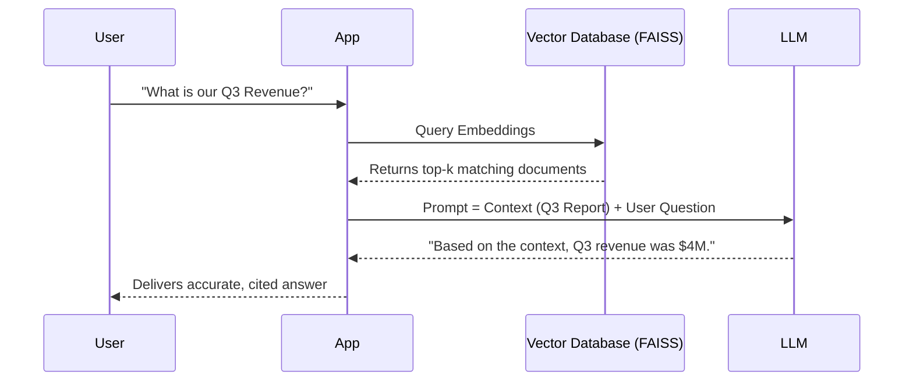

# Generative AI & MLOps

In the final phase of the syllabus, we move from predictive models to *generative* models, focusing specifically on Large Language Models (LLMs). Furthermore, we learn how to take these massive models out of Jupyter Notebooks and deploy them reliably into production environments.

## The Transformer Architecture

In 2017, the paper "Attention Is All You Need" changed AI forever by introducing the Transformer. Unlike RNNs that read text sequentially, Transformers use a mechanism called **Self-Attention** to process entire sentences simultaneously, mapping the complex relationships between all words.

## Retrieval-Augmented Generation (RAG)

LLMs hallucinate and they don't know your private data. RAG solves this.



### RAG Components
1. **Embedding Model**: Converts text into numerical vectors.
2. **Vector Database**: Stores embeddings for ultra-fast semantic search (e.g., Chroma, FAISS, Milvus).
3. **Generator (LLM)**: Takes the retrieved context and answers the user's prompt.

---

## MLOps: Productionizing AI

Machine Learning Operations (MLOps) is DevOps for AI. Code is only 10% of an AI system; the rest is data pipelines, tracking, and monitoring.

| Tool | Category | Purpose |
|------|----------|---------|
| **MLflow** | Experiment Tracking | Logs model parameters, metrics, and artifacts automatically. |
| **Docker** | Containerization | Packages your model so it runs identically on any server. |
| **FastAPI**| Model Serving | Wraps your Python model into a high-speed REST API. |

---

## Practical Example: Hugging Face Pipelines

Hugging Face has democratized access to state-of-the-art open-source LLMs. You can load a powerful transformer model in just a few lines of code using their `transformers` library.

```python
from transformers import pipeline

# 1. Initialize a Text Generation pipeline
# This automatically downloads the model weights and tokenizer
generator = pipeline('text-generation', model='gpt2')

# 2. Define your prompt
prompt = "The future of Artificial Intelligence is"

# 3. Generate text
response = generator(prompt, max_length=50, num_return_sequences=1)

print(response[0]['generated_text'])
```

> [!WARNING]
> **Production Note:** Running models locally like this is great for prototyping. In production, you would deploy this pipeline behind a FastAPI endpoint running on a GPU-enabled Docker container!
