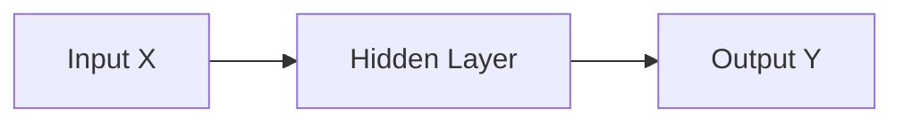

# Neural Network Foundations & MLP

Deep Learning models represent high-level representations through layered abstract connections, simulating biological cognitive pathways.

## Multi-Layer Perceptrons (MLPs)
An MLP is a forward-feeding neural structure consisting of an Input layer, one or more Hidden layers, and an Output layer.



## Backpropagation & Optimization
The error is propagated backward through the network using the mathematical **Chain Rule** to compute gradients of the loss with respect to all weights and biases.

```python
# PyTorch simple implementation
import torch.nn as nn
model = nn.Sequential(
    nn.Linear(784, 128),
    nn.ReLU(),
    nn.Linear(128, 10)
)
```

> [!TIP]
> **Activation Functions:** Non-linear activation functions (ReLU, Sigmoid, Tanh) are crucial. Without them, a multi-layer neural network collapses into a single linear transformation!
