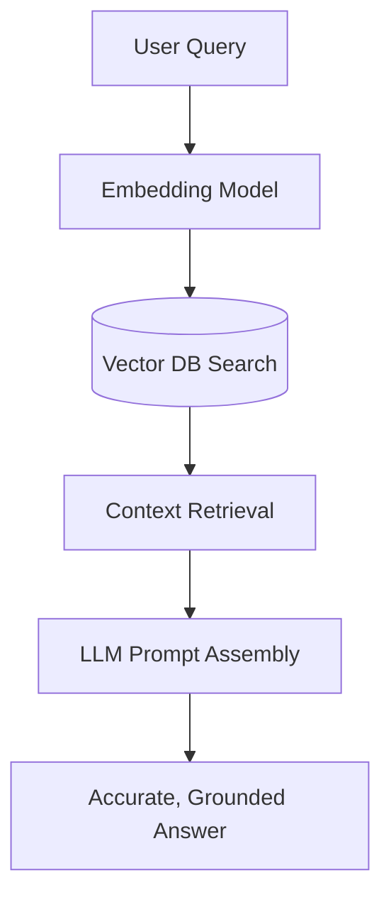

# Context Management, Prompting & RAG Pipelines

Foundation models have static knowledge cutoffs and hallucination tendencies. We explore prompt management and dynamic context injection.

## Retrieval-Augmented Generation (RAG)
Instead of expensive retraining, RAG dynamically fetches relevant source documents and feeds them to the LLM as context along with the user's query.

## Vector Databases
Vector databases (Chroma, Pinecone, FAISS) index high-dimensional embeddings to perform cosine similarity searches in milliseconds.
